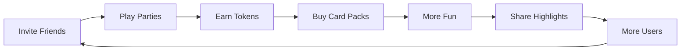

# Yowimo Product Vision

**Version:** 1.0.0

**Status:** Living Product Specification

**Owner:** Product & Engineering

**Depends On:**

- 00_READ_ME_FIRST.md

---

# Purpose

This document defines the vision, mission, target audience, business goals, and long-term direction of the Yowimo platform.

Every engineering decision should support this vision.

If a proposed feature does not contribute to the product vision, it should be reconsidered.

---

# Vision Statement

> Build the world's most engaging social entertainment platform where friends, families, couples, communities, creators, and companies connect through unforgettable interactive experiences.

Yowimo exists to transform ordinary gatherings into extraordinary moments.

Whether people are sitting together in a living room, connected through video, or participating from around the world, Yowimo should make every party feel alive.

---

# Mission

Create the easiest and most entertaining way for people to play together regardless of location.

The platform should eliminate friction by making it possible to:

• create parties in seconds

• invite anyone

• play instantly

• compete

• laugh

• earn rewards

• create memories

---

# Core Product Pillars

Everything built inside Yowimo belongs to one of these pillars.

---

# 1. Party Platform

The primary product.

Users create parties.

Invite friends.

Play together.

Examples

- Truth or Dare

- Never Have I Ever

- Couples Night

- Office Icebreakers

- Family Night

- Drinking Games

Future

- Tournament Mode

- Tournament Seasons

- Community Parties

---

# 2. Social Platform

Yowimo is not simply a game.

It is a social network centered around shared experiences.

Examples

- Friends

- Profiles

- Followers

- Party History

- Highlights

- Reactions

- Comments

- Invitations

Future

- Creator Profiles

- Verified Hosts

- Community Pages

---

# 3. Game Platform

The Game Engine powers every experience.

Games become plugins.

Examples

Truth or Dare

Would You Rather

Charades

Hot Seat

Most Likely To

Trivia

Couples Quiz

Corporate Icebreakers

Future

Developers may create their own games.

---

# 4. Token Economy

Tokens drive engagement.

Players earn and spend tokens.

Sources

- Referrals

- Daily Login

- Achievements

- Watching Ads

- Winning Games

- Sponsored Events

- Purchasing Tokens

Uses

- Party Entry

- Marketplace

- Premium Packs

- Cosmetic Unlocks

- AI Features

Future

Creator Economy

Tournament Entry

NFT-free digital collectibles

---

# 5. Marketplace

Marketplace extends the game.

Products include

Premium Card Packs

Themes

Animations

Party Effects

Voice Packs

Corporate Bundles

Holiday Collections

Limited Drops

Future

Creator Marketplace

Brand Collaborations

Seasonal Events

Subscriptions

---

# 6. AI Experiences

AI is an assistant.

Never the product.

Examples

AI Host

Voice Narration

Translation

Smart Recommendations

Party Summaries

Challenge Generation

Personalized Card Selection

Future

AI Party Planning

AI Matchmaking

AI Moderation

---

# 7. Corporate Platform

Companies should be able to host engaging virtual and physical events.

Examples

Team Building

Onboarding

Icebreakers

Training

Conferences

Networking

Future

Enterprise Dashboard

Company Analytics

HR Reporting

Custom Branding

---

# Product Principles

Every feature must satisfy these principles.

---

## Social First

People come before mechanics.

Games exist to create conversations.

Not the other way around.

---

## Fun First

Entertainment wins.

If a feature increases complexity while reducing fun, it should be redesigned.

---

## Fast

Creating a party should take less than 60 seconds.

Joining should take less than 30 seconds.

---

## Inclusive

The platform should support

Friends

Couples

Families

Remote Teams

Corporate Users

Creators

Communities

International Players

---

## Safe

Users must always remain in control.

Privacy

Moderation

Blocking

Reporting

Content Filtering

Age Restrictions

must exist from day one.

---

# Primary User Personas

---

## Casual Friends

Age

18–35

Goals

Play during weekends

House parties

Video calls

Birthdays

Pain Points

Boring conversations

Repeated games

Low engagement

---

## Couples

Goals

Date nights

Relationship challenges

Travel entertainment

Pain Points

Limited quality games

Repetitive experiences

---

## Families

Goals

Safe entertainment

Movie nights

Holiday gatherings

Pain Points

Games that are inappropriate

---

## Corporate Teams

Goals

Remote engagement

Employee bonding

Icebreakers

Training

Pain Points

Low meeting engagement

---

## Party Hosts

Goals

Create memorable events

Manage guests

Keep everyone involved

Pain Points

Managing large groups

Explaining rules

Keeping momentum

---

# Competitive Advantages

Yowimo combines multiple experiences into one platform.

Instead of offering only games,

it provides:

✓ Party Hosting

✓ AI Host

✓ Video Rooms

✓ Physical Play

✓ Hybrid Play

✓ TV Mode

✓ Token Rewards

✓ Marketplace

✓ Sponsorships

✓ Corporate Events

✓ Community Growth

This combination creates a stronger network effect than single-purpose party game apps.

---

# Revenue Model

Primary

Token Purchases

Marketplace Purchases

Premium Card Packs

Subscriptions

Sponsored Events

Corporate Licenses

Advertising Rewards

Future

Creator Revenue Share

Tournament Tickets

Enterprise Plans

White-label Licensing

---

# Success Metrics

North Star Metric

> Weekly Active Party Participants (WAPP)

Supporting Metrics

Daily Active Users

Monthly Active Users

Average Party Duration

Average Players per Party

Retention (D1, D7, D30)

Token Velocity

Marketplace Conversion Rate

Referral Rate

Corporate Events Hosted

Average Session Length

Crash-Free Sessions

---

# Product Roadmap

## Phase 1

Core Platform

Authentication

Profiles

Wallet

Party Creation

Party Discovery

Invitations

Marketplace

Basic Games

---

## Phase 2

Realtime

Chat

Voice

LiveKit

TV Mode

Spectators

Hybrid Parties

---

## Phase 3

AI

AI Host

Voice Narration

Translations

Smart Recommendations

Dynamic Challenges

---

## Phase 4

Creator Economy

Custom Packs

Creator Profiles

Creator Marketplace

Revenue Sharing

---

## Phase 5

Competitive Play

Leaderboards

Ranked Seasons

Achievements

Tournaments

Rewards

---

## Phase 6

Enterprise

Corporate Dashboard

Analytics

Brand Sponsorship

HR Reporting

Custom Branding

---

# Product Flywheel

---

# Long-Term Vision

Within five years, Yowimo should evolve from a party game application into a global social entertainment ecosystem.

The platform should support millions of users across:

- Mobile
- Tablets
- Smart TVs
- Web
- Consoles (future)
- XR Devices (future)

while enabling creators, businesses, and communities to build interactive social experiences.

---

# Engineering Implications

Because of this vision, every system should be designed with extensibility in mind.

Examples:

- Games must be modular.
- Wallet must support new earning and spending mechanisms.
- Marketplace must accommodate digital products, subscriptions, and creator assets.
- Party architecture must support future tournament and enterprise modes.
- AI integrations should use provider abstractions rather than vendor-specific implementations.
- APIs must be versioned from the start.

---

# Acceptance Criteria

This document is considered complete when:

- Every major feature maps to one or more product pillars.
- The product vision clearly guides engineering decisions.
- Business goals and technical architecture remain aligned.
- Future roadmap items can be introduced without redefining the platform's core identity.
