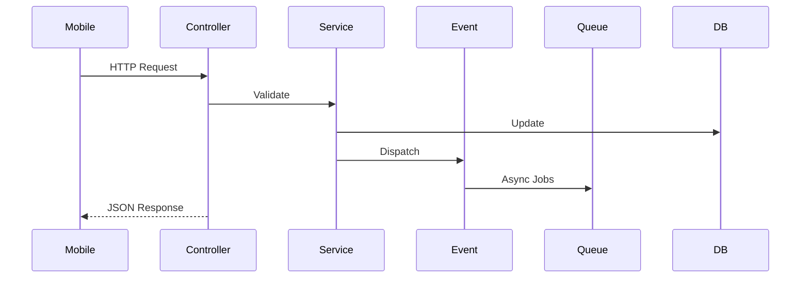

# Yowimo System Architecture

**Version:** 1.0.0

**Status:** Living Engineering Specification

**Owner:** Platform Engineering

**Depends On**

- 00_READ_ME_FIRST.md
- 01_PRODUCT_VISION.md

---

# Purpose

This document defines the overall architecture of the Yowimo platform.

It explains how every subsystem communicates, where business logic belongs, how new features should be added, and how the platform is expected to scale from thousands to millions of users.

This document is the architectural foundation for every future implementation phase.

---

# Architectural Philosophy

Yowimo is built using a **Modular Monolith** architecture.

This approach combines the simplicity of a monolithic application with the separation and maintainability of microservices.

At launch, every module lives inside one Laravel application.

As traffic grows, individual modules can later be extracted into independent services with minimal changes.

---

# Why Modular Monolith?

Traditional monoliths become difficult to maintain because unrelated features become tightly coupled.

Microservices introduce operational complexity too early.

A Modular Monolith gives us:

✓ Simple deployment

✓ Fast development

✓ Shared database

✓ Easy debugging

✓ Strong module boundaries

✓ Future microservice migration

---

# High-Level Architecture

```mermaid
flowchart TB

Client["React Native App"]

API["Laravel API"]

subgraph Platform

Auth

Users

Friends

Wallet

Parties

Game Engine

Marketplace

AI Host

Realtime

Notifications

Analytics

Admin

end

Database[(PostgreSQL)]

Redis[(Redis)]

Reverb[Laravel Reverb]

LiveKit[LiveKit]

Storage[S3 / R2]

Push[Firebase / APNs]

Client --> API

API --> Database

API --> Redis

API --> Reverb

API --> LiveKit

API --> Storage

API --> Push
```

---

# Core Platform Modules

Every feature belongs to one module.

No module owns another module's business logic.

Modules communicate through:

- Services
- Events
- Queued Jobs
- Policies

Never through direct model manipulation.

---

# Module Overview

| Module         | Responsibility                    |
| -------------- | --------------------------------- |
| Authentication | Clerk authentication and identity |
| Users          | Profiles, settings, avatars       |
| Friends        | Social graph                      |
| Wallet         | Token balances and ledger         |
| Marketplace    | Digital products                  |
| Party          | Party lifecycle                   |
| Game Engine    | Gameplay                          |
| AI Host        | Voice, narration, AI moderation   |
| LiveKit        | Video rooms                       |
| Realtime       | Broadcasting                      |
| Notifications  | Push, email, SMS                  |
| Sponsorship    | Sponsored parties                 |
| Rewards        | Achievements and bonuses          |
| Analytics      | Metrics and reporting             |
| Admin          | Internal management               |

---

# Bounded Contexts

Each module is its own bounded context.

```text
Authentication

↓

Users

↓

Friends

↓

Party

↓

Game Engine

↓

Results

↓

Rewards
```

Wallet exists independently.

Marketplace exists independently.

AI Host exists independently.

---

# Dependency Rules

Allowed

```
Party
↓

Game Engine
↓

Rewards
```

Allowed

```
Marketplace
↓

Wallet
```

Allowed

```
Rewards
↓

Wallet
```

Not Allowed

```
Wallet

↓

Game Engine
```

Game Engine must never modify balances directly.

Instead:

```
Game Finished

↓

Reward Event

↓

Reward Service

↓

Wallet Service
```

---

# Request Lifecycle



Controllers remain thin.

Business logic belongs inside services.

---

# Folder Structure

```
app/

Modules/

Authentication/

Users/

Friends/

Wallet/

Marketplace/

Party/

Game/

Realtime/

Notifications/

AI/

Admin/
```

Each module contains

```
Actions/

Controllers/

DTOs/

Events/

Exceptions/

Jobs/

Listeners/

Models/

Policies/

Repositories/

Requests/

Resources/

Routes/

Services/

Traits/

ValueObjects/
```

---

# Service Layer

Every module exposes services.

Example

```
PartyService

WalletService

MarketplaceService

RewardService

GameEngineService
```

Controllers may only communicate with services.

Never write business logic in controllers.

---

# Repository Layer

Repositories isolate persistence.

Example

```
UserRepository

PartyRepository

WalletRepository

GameRepository
```

Repositories never contain business rules.

Only data access.

---

# Event Driven Architecture

Every important action emits an event.

Examples

```
PartyCreated

PartyStarted

PlayerJoined

RoundStarted

TurnStarted

CardDrawn

ChallengeCompleted

WalletCredited

WalletDebited

PurchaseCompleted

RewardGranted
```

Benefits

Loose coupling

Easy analytics

Easy notifications

Scalable architecture

---

# Queue Architecture

Time consuming work should never block API requests.

Queue examples

Push Notifications

Emails

Reward Calculations

Highlight Generation

Image Processing

Video Processing

Analytics

Leaderboard Updates

Future AI Jobs

---

# Redis Responsibilities

Redis stores

Presence

Queues

Rate Limits

Temporary Game State

Session Cache

Locks

Broadcast State

Never permanent business data.

---

# Database Responsibilities

PostgreSQL stores

Users

Wallet

Transactions

Marketplace

Games

Cards

Rewards

Analytics

Everything requiring long-term persistence.

---

# Realtime Layer

Realtime communication is handled exclusively by Laravel Reverb.

Responsibilities

Party Presence

Countdown Timers

Chat

Player Status

Turn Changes

Votes

Audience Reactions

Game Progress

---

# LiveKit Layer

LiveKit is responsible only for media.

Responsibilities

Voice

Video

Screen Sharing

Spatial Audio

Recording

It does NOT manage

Wallet

Game Logic

Scores

Players

Turns

---

# Media Flow

```mermaid
flowchart LR

Player

↓

LiveKit

↓

Participants

↓

Mobile Clients

```

Game state still comes from Laravel.

---

# Notification Architecture

Notifications originate from Events.

```
PartyStarted

↓

Listener

↓

Notification Job

↓

Firebase

↓

Mobile Device
```

Never send notifications directly from controllers.

---

# Storage Architecture

Object storage contains

Profile Images

Party Images

Marketplace Assets

Highlight Videos

Generated AI Images

Future Creator Content

Metadata remains in PostgreSQL.

---

# AI Architecture

AI is provider agnostic.

```
AI Interface

↓

OpenAI

↓

Anthropic

↓

Gemini

↓

Future Providers
```

The rest of the application depends only on the interface.

Never directly on an AI vendor SDK.

---

# API Design

REST first.

Realtime second.

Future GraphQL if required.

API Versioning

```
/api/v1/

/api/v2/
```

Never introduce breaking changes inside an existing version.

---

# Scaling Strategy

Phase 1

Single Application

↓

Phase 2

Multiple Queue Workers

↓

Phase 3

Multiple API Servers

↓

Phase 4

Read Replicas

↓

Phase 5

Redis Cluster

↓

Phase 6

CDN

↓

Phase 7

Microservice Extraction

---

# Candidate Microservices

When necessary these modules can become independent services.

Wallet

Marketplace

Notifications

Analytics

AI

Media

Search

Recommendation Engine

Because module boundaries are already defined, extraction requires minimal refactoring.

---

# Security Boundaries

Every module owns its authorization.

Examples

Party Policy

Wallet Policy

Marketplace Policy

Reward Policy

Controllers never implement permission logic.

Policies enforce permissions.

---

# Observability

Every module should expose

Structured Logs

Metrics

Health Checks

Tracing

Queue Monitoring

Performance Counters

This enables production monitoring from day one.

---

# Architectural Principles

1. Backend is authoritative.
2. Modules are isolated.
3. Business logic belongs in services.
4. Data access belongs in repositories.
5. Communication happens through events.
6. Expensive work is queued.
7. Media and game logic remain separate.
8. APIs are versioned.
9. AI integrations use abstraction layers.
10. Every module is independently testable.

---

# Claude Code Instructions

Before implementing any feature:

1. Determine which module owns the feature.
2. Audit the module for existing services and repositories.
3. Extend existing architecture before creating new classes.
4. Do not bypass module boundaries.
5. Dispatch events instead of tightly coupling modules.
6. Use queues for long-running work.
7. Update documentation if architecture changes.

---

# Acceptance Criteria

This architecture is considered successful when:

- Every feature has a clear module owner.
- No business logic exists in controllers.
- Modules communicate through events and services.
- Realtime, media, and business logic remain decoupled.
- The system can evolve into microservices without major rewrites.
- New developers can identify where any feature belongs without ambiguity.
