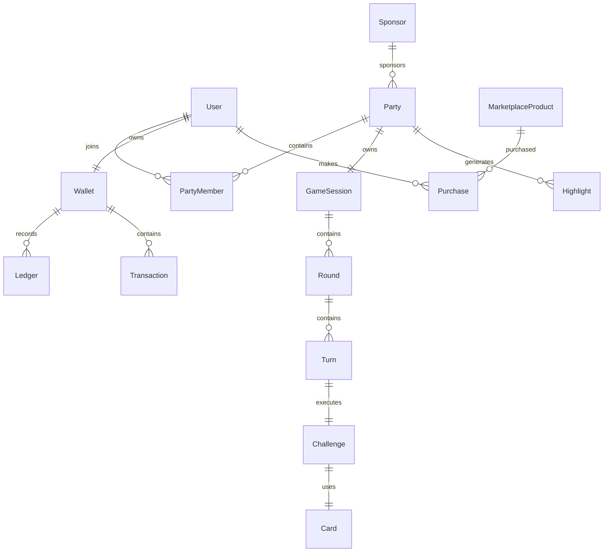

# Yowimo Domain Model

**Version:** 1.0.0

**Status:** Living Engineering Specification

**Owner:** Platform Engineering

**Depends On**

- 00_READ_ME_FIRST.md
- 01_PRODUCT_VISION.md
- 02_SYSTEM_ARCHITECTURE.md

---

# Purpose

This document defines the business domain of Yowimo.

Unlike the database design, which focuses on tables, this document focuses on business concepts.

It answers questions such as:

- What is a Party?
- What is a Game Session?
- What is a Round?
- Who owns Rewards?
- What belongs inside Wallet?
- What relationships exist between entities?

Everything implemented in the backend should originate from this domain model.

---

# Domain Overview

```mermaid
flowchart TB

User

Party

PartyMember

Invitation

GameSession

Round

Turn

Challenge

Card

Vote

Reward

Wallet

Ledger

Transaction

Marketplace

Purchase

Sponsor

Highlight

Notification

AIHost

LiveKitRoom
```



---

# Domain Boundaries

```text
Authentication

↓

Users

↓

Social

↓

Party

↓

Game Engine

↓

Results

↓

Rewards

↓

Wallet

↓

Marketplace
```

Each domain owns its business rules.

---

# Aggregate Roots

Aggregate roots are the primary entities responsible for maintaining consistency within a domain.

Yowimo defines the following aggregate roots:

- User
- Party
- GameSession
- Wallet
- MarketplaceProduct
- Sponsor
- Notification
- AIHost

Child entities should only be modified through their aggregate root.

---

# User Domain

## Aggregate Root

User

Represents a registered person using Yowimo.

The User aggregate owns:

- Profile
- Friends
- Settings
- Devices
- Wallet
- Achievements
- Statistics

---

## User Responsibilities

A User can:

Create Parties

Join Parties

Leave Parties

Invite Friends

Purchase Products

Earn Tokens

Spend Tokens

Receive Rewards

Send Messages

Create Highlights

Interact with AI Host

---

## User Relationships

```text
User

↓

Profile

↓

Wallet

↓

Party Memberships

↓

Purchases

↓

Rewards

↓

Notifications
```

---

# Party Domain

## Aggregate Root

Party

Represents a social event.

A Party owns:

Party Members

Invitations

Party Settings

Party Status

Game Session

Sponsor

Chat

Highlights

---

## Party Lifecycle

```mermaid
stateDiagram-v2

Created

-->Scheduled

Scheduled

-->Open

Open

-->Started

Started

-->Paused

Paused

-->Started

Started

-->Completed

Completed

-->Archived
```

---

## Party Status

Created

Scheduled

Open

Locked

Live

Paused

Completed

Cancelled

Archived

---

## Party Member

Represents a participant.

Attributes

User

Role

Status

JoinedAt

ReadyState

Score

TokensSpent

TokensEarned

---

Roles

Host

CoHost

Player

Spectator

Moderator

AI Host

---

# Invitation Domain

Invitation belongs to Party.

Invitation may target

Friend

Phone Number

Email

QR Code

Public Link

Invitation States

Pending

Accepted

Declined

Expired

Cancelled

---

# Game Engine Domain

## Aggregate Root

GameSession

A Party may contain one GameSession.

The GameSession owns

Rounds

Turns

Challenges

Votes

Results

Timers

---

GameSession Lifecycle

```mermaid
stateDiagram-v2

Waiting

-->Preparing

Preparing

-->Running

Running

-->Paused

Paused

-->Running

Running

-->Completed

Completed

-->Archived
```

---

# Round

A GameSession consists of many Rounds.

Round owns

Turns

Cards

Timer

Votes

Round Results

---

Round Status

Pending

Active

Completed

Skipped

Cancelled

---

# Turn

A Turn belongs to a Round.

One player acts during one Turn.

Turn owns

Challenge

Timer

Completion Status

Audience Reactions

---

Turn States

Waiting

Started

Performing

Completed

Skipped

Expired

---

# Challenge

Represents the selected activity.

Examples

Truth

Dare

Trivia

Would You Rather

Hot Seat

Never Have I Ever

---

Challenge Properties

Difficulty

Age Rating

Category

Duration

Token Multiplier

Risk Level

Language

---

# Card Domain

Cards are immutable content.

Cards belong to Packs.

Card Fields

Question

Challenge

Difficulty

Category

Locale

Tags

Reward Multiplier

---

Card Packs

Core Pack

Premium Pack

Holiday Pack

Corporate Pack

Creator Pack

Limited Edition

---

# Voting Domain

Some games require voting.

Vote belongs to Turn.

Vote Types

Winner

Loser

Funniest

Best Performance

Skip

Penalty

---

Vote States

Open

Closed

Verified

---

# Reward Domain

Rewards are immutable historical records.

Rewards may originate from

Achievements

Party Completion

Referrals

Advertisements

Sponsors

Purchases

Admin

---

Reward Types

Tokens

Badge

XP

Rank

Title

Marketplace Unlock

---

# Wallet Domain

Aggregate Root

Wallet

Wallet owns

Ledger

Transactions

Balance Snapshot

Reward History

Purchase History

Sponsor Credits

---

Wallet Responsibilities

Calculate Balance

Validate Spending

Credit Tokens

Debit Tokens

Reserve Tokens

Release Tokens

---

Wallet Rule

Balance is NEVER edited directly.

Balance is derived from Ledger entries.

---

# Ledger Domain

Ledger is append only.

Never update Ledger rows.

Never delete Ledger rows.

Ledger represents financial truth.

---

# Transaction Domain

Represents financial movement.

Examples

Purchase

Reward

Refund

Sponsor Credit

Marketplace Purchase

Party Entry

Ad Reward

Referral Bonus

---

Transaction Status

Pending

Processing

Completed

Cancelled

Failed

Refunded

---

# Marketplace Domain

Aggregate Root

MarketplaceProduct

Products include

Card Packs

Bundles

Themes

Subscriptions

Animations

Voice Packs

Boosts

---

Purchase Domain

Purchase owns

Product

Price

Discount

Payment

Receipt

Delivery Status

---

Purchase States

Pending

Paid

Delivered

Refunded

Cancelled

---

# Sponsorship Domain

Aggregate Root

Sponsor

Sponsor may fund

Players

Parties

Corporate Events

Tournament Entries

Rewards

---

Sponsor Rules

Sponsors never receive Wallet ownership.

Sponsors cannot withdraw user balances.

Sponsor credits remain isolated.

---

# Highlight Domain

Highlights represent memorable moments.

Highlight Sources

Photos

Videos

AI Generated Clips

Screenshots

Player Reactions

---

Highlight Lifecycle

Created

Processed

Published

Archived

Deleted

---

# AI Host Domain

Aggregate Root

AIHost

Responsibilities

Narration

Voice

Moderation

Recommendations

Translations

Party Summary

Challenge Suggestions

---

AI Personality

Friendly

Energetic

Funny

Respectful

Inclusive

Adaptive

---

# LiveKit Room Domain

Each Party owns one LiveKit Room.

Room contains

Participants

Media Tracks

Permissions

Recording

Metadata

---

Room States

Created

Open

Live

Closing

Closed

---

# Notification Domain

Notifications originate from Events.

Notification Channels

Push

Email

SMS

In-App

Future

WhatsApp

Telegram

Discord

---

Notification Status

Queued

Sent

Delivered

Failed

Read

Dismissed

---

# Analytics Domain

Analytics collects data only.

Never changes business state.

Metrics include

DAU

MAU

Session Length

Retention

Revenue

Party Duration

Cards Played

Token Velocity

Marketplace Conversion

---

# Entity Relationships



---

# Ownership Rules

Only Party creates GameSessions.

Only GameSession creates Rounds.

Only Round creates Turns.

Only Turn executes Challenges.

Only Reward Service credits Wallet.

Only Wallet Service writes Ledger.

Only Marketplace creates Purchases.

Only Sponsor Service creates Sponsorships.

---

# Domain Events

Examples

UserRegistered

FriendAdded

PartyCreated

InvitationAccepted

PartyStarted

RoundStarted

TurnStarted

ChallengeCompleted

RewardGranted

WalletCredited

PurchaseCompleted

SponsorCreated

HighlightGenerated

AIHostActivated

RoomCreated

---

# Future Domains

Reserved

Tournament

Creator Economy

Organizations

Subscriptions

Moderation

Streaming

Advertising

Recommendations

Machine Learning

---

# Claude Code Instructions

When implementing a feature:

1. Identify the owning aggregate.
2. Never bypass aggregate boundaries.
3. Never update child entities directly.
4. Dispatch domain events after successful state changes.
5. Preserve invariants defined in this document.
6. If a new business concept is introduced, update this document before writing code.

---

# Acceptance Criteria

This domain model is considered complete when:

- Every business concept has a clear owner.
- Aggregate roots enforce consistency.
- Relationships are well defined.
- Future features have reserved extension points.
- Developers can map any feature to a specific domain without ambiguity.
