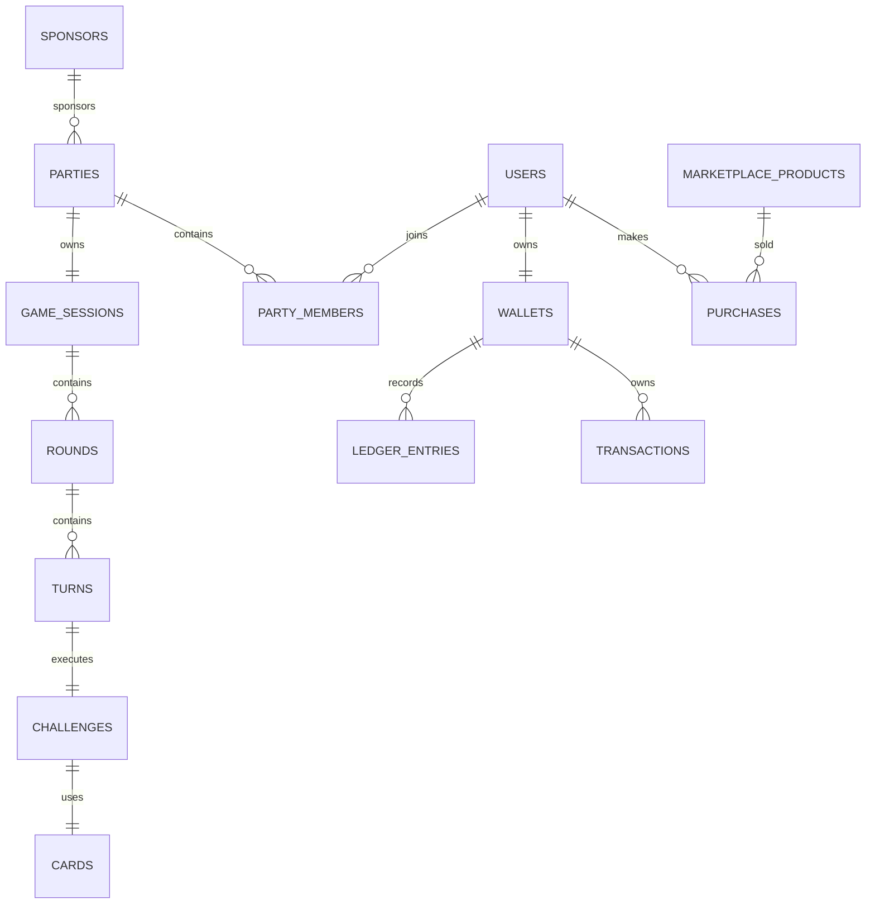

# Yowimo Database Architecture

**Version:** 1.0.0

**Status:** Living Engineering Specification

**Owner:** Platform Engineering

**Depends On**

- 00_READ_ME_FIRST.md
- 01_PRODUCT_VISION.md
- 02_SYSTEM_ARCHITECTURE.md
- 03_DOMAIN_MODEL.md

---

# Purpose

This document defines how persistent data is stored throughout the Yowimo platform.

It serves as the single source of truth for:

- Database design
- Naming conventions
- Migration standards
- Relationships
- Indexing
- UUID strategy
- Soft deletes
- Audit logging
- Future scalability

Every migration must follow this specification.

---

# Database Engine

Yowimo uses:

PostgreSQL 17+

Reasons:

✓ Strong ACID compliance

✓ JSONB support

✓ Partial indexes

✓ Full-text search

✓ Row-level locking

✓ Window functions

✓ Excellent scaling

✓ Mature replication support

---

# Database Philosophy

Database tables should represent business entities.

Avoid creating tables that exist only for implementation convenience.

Every table should have:

- One clear responsibility
- One aggregate owner
- Explicit relationships
- Consistent naming

---

# Database Naming Rules

## Tables

Plural

snake_case

Examples

```
users

wallets

parties

party_members

game_sessions

rounds

turns

transactions

marketplace_products
```

Never

```
User

tbl_users

partyMember

PartyTable
```

---

# Columns

snake_case

Examples

```
party_id

user_id

wallet_balance

created_at

updated_at
```

---

# Foreign Keys

Always end with `_id`

Examples

```
user_id

party_id

wallet_id

purchase_id
```

Never

```
owner

party

wallet
```

---

# Primary Keys

Every table uses UUID v7.

```php
id UUID PRIMARY KEY
```

Reasons

- Better distributed generation
- No enumeration attacks
- Easier data merging
- Future multi-region support

Laravel should generate UUIDs automatically.

---

# Timestamp Policy

Every table includes

```sql
created_at

updated_at
```

unless the table is immutable.

---

# Soft Delete Policy

Use Soft Deletes for:

Users

Parties

Marketplace Products

Card Packs

Sponsors

Highlights

Do NOT use Soft Deletes for:

Ledger

Transactions

Rewards

Votes

Analytics

Audit Logs

Financial history must never disappear.

---

# Audit Strategy

Every critical action is auditable.

Examples

```
Wallet Updated

Reward Granted

Purchase Completed

Admin Actions

Party Deleted

Role Changed
```

Audit data should never be mixed with business tables.

Future

```
audit_logs
```

---

# JSON Columns

Allowed only for flexible metadata.

Examples

```
settings

preferences

provider_metadata

ai_context

device_information
```

Never store business relationships inside JSON.

---

# Enum Policy

Application Enums

Preferred

Laravel Enum Classes

Database Enums

Only when values are permanent.

Examples

```
PartyStatus

TransactionStatus

RewardType

PurchaseStatus
```

---

# Decimal Policy

Money

Never float.

Use

```
NUMERIC(18,2)
```

Tokens

```
BIGINT
```

Never

```
FLOAT

DOUBLE
```

---

# Boolean Policy

Examples

```
is_active

is_public

is_verified

is_sponsored
```

Never

```
status = yes/no
```

---

# Cascade Rules

Use

```
ON DELETE RESTRICT
```

by default.

Use

```
ON DELETE CASCADE
```

only for child entities.

Example

```
Party

↓

Party Members
```

Deleting a Party deletes Party Members.

Deleting a User does NOT delete Transactions.

---

# Indexing Strategy

Every table must define indexes during migration.

Required indexes

Foreign Keys

Status Columns

Created At

Updated At

Composite Search Keys

---

Example

```
INDEX

party_id

status

created_at
```

---

# Composite Index Example

Party Members

```
party_id

user_id
```

Unique

One user may only join once.

---

# Unique Constraints

Examples

```
email

username

referral_code

wallet_id
```

Composite Examples

```
party_id

user_id
```

```
game_session_id

round_number
```

---

# Partition Strategy

Future

Large tables become partitioned.

Candidates

Analytics

Notifications

Audit Logs

Highlights

Event Logs

---

# Storage Strategy

Database stores metadata.

Object Storage stores files.

Example

```
users.avatar_url

↓

S3
```

Database never stores image blobs.

---

# ER Diagram



---

# Module Tables

## Authentication

```
users

user_devices

user_sessions
```

---

## Profile

```
profiles

avatars

preferences
```

---

## Friends

```
friendships

friend_requests

blocks
```

---

## Wallet

```
wallets

ledger_entries

transactions

wallet_snapshots
```

---

## Marketplace

```
marketplace_products

product_categories

product_bundles

purchases

purchase_items

discount_codes
```

---

## Party

```
parties

party_members

party_invitations

party_settings

party_chat
```

---

## Game Engine

```
game_sessions

rounds

turns

challenges

cards

card_packs

votes

timers
```

---

## AI

```
ai_conversations

ai_messages

ai_usage_logs
```

---

## Sponsorship

```
sponsors

sponsorships

sponsor_wallets
```

---

## Rewards

```
rewards

achievements

achievement_progress
```

---

## Notifications

```
notifications

notification_deliveries
```

---

## LiveKit

```
livekit_rooms

room_participants

recordings
```

---

## Analytics

```
analytics_events

party_metrics

retention_reports

daily_statistics
```

---

# Migration Order

Always create tables in dependency order.

```
Users

↓

Profiles

↓

Wallets

↓

Friends

↓

Marketplace

↓

Parties

↓

Party Members

↓

Invitations

↓

Game Sessions

↓

Rounds

↓

Turns

↓

Challenges

↓

Cards

↓

Transactions

↓

Rewards

↓

Notifications

↓

Analytics
```

Never create circular dependencies.

---

# Migration Rules

Every migration must

✓ Include indexes

✓ Include foreign keys

✓ Include comments

✓ Use UUIDs

✓ Follow naming conventions

✓ Support rollback

Never edit existing migrations.

Create new migrations instead.

---

# Query Performance

Always eager load relationships.

Never perform N+1 queries.

Example

Good

```php
Party::with([
    'host',
    'members.user',
    'gameSession.rounds'
]);
```

Bad

```php
foreach ($party->members as $member) {
    echo $member->user->name;
}
```

---

# Caching

Frequently accessed data

User Profile

Wallet Balance

Party Details

Marketplace Products

Leaderboard

Store in Redis.

Never cache financial transactions.

---

# Database Transactions

Wrap business-critical operations.

Example

```
Purchase

↓

Debit Wallet

↓

Create Transaction

↓

Grant Product

↓

Commit
```

Rollback on failure.

---

# Backup Strategy

Production

Daily Full Backup

Hourly WAL Archive

30-Day Retention

Encrypted Storage

Quarterly Restore Test

---

# Future Scaling

Current

Single PostgreSQL

↓

Read Replica

↓

Connection Pooling

↓

Partitioning

↓

Regional Databases

↓

Multi-region Writes

---

# Claude Code Instructions

Before creating migrations:

1. Audit existing schema.
2. Reuse tables where appropriate.
3. Never duplicate entities.
4. Add indexes during creation.
5. Add foreign keys immediately.
6. Follow migration order.
7. Keep migrations reversible.
8. Update this document if new tables are introduced.

---

# Acceptance Criteria

This database architecture is complete when:

- Every module has defined tables.
- Naming conventions are consistently applied.
- UUIDs are used platform-wide.
- Financial data is immutable.
- Indexes support expected query patterns.
- Schema evolution can occur without breaking production.

---
