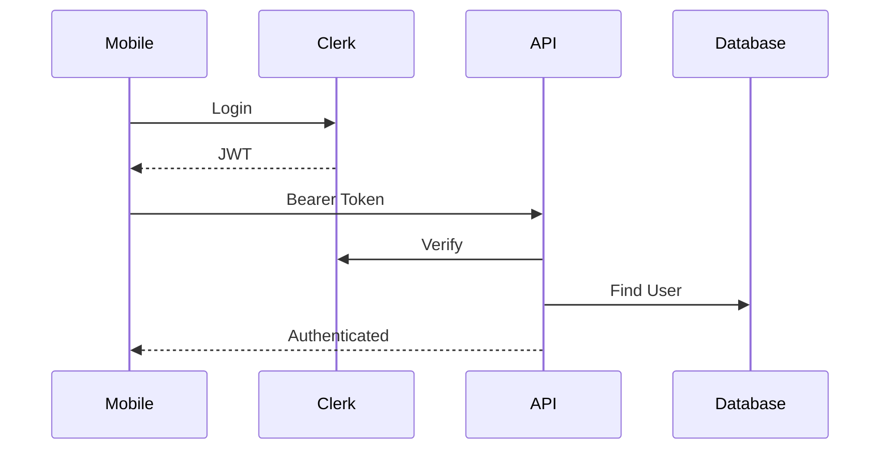

# Yowimo Security Standards

**Version:** 1.0.0

**Status:** Living Engineering Specification

**Owner:** Platform Security Team

**Depends On**

- 00_READ_ME_FIRST.md
- 02_SYSTEM_ARCHITECTURE.md
- 04_DATABASE_ARCHITECTURE.md
- 05_API_STANDARDS.md

---

# Purpose

Security is not a feature.

Security is part of the architecture.

Every module in Yowimo must follow these standards to protect users, financial assets, personal information, gameplay integrity, and business data.

This document defines the minimum security baseline required for every implementation.

---

# Security Philosophy

Yowimo follows the principle of **Defense in Depth**.

No single layer should be trusted.

Every request must pass through multiple security layers.

```text
Client

↓

HTTPS

↓

Cloudflare

↓

Rate Limiter

↓

Authentication

↓

Authorization

↓

Validation

↓

Business Rules

↓

Database
```

---

# Security Principles

Every feature must satisfy the following:

✓ Least Privilege

✓ Zero Trust

✓ Secure by Default

✓ Explicit Authorization

✓ Immutable Financial Records

✓ Audit Everything

✓ Encrypt Sensitive Data

✓ Fail Securely

---

# Authentication

Authentication is managed by Clerk.

Laravel never manages passwords.

Responsibilities of Clerk:

- User Registration
- Login
- Session Management
- MFA
- Social Login
- Email Verification
- Password Reset
- Device Trust

Laravel responsibilities:

- Verify JWT
- Synchronize User
- Load Permissions
- Load Roles

---

# Authentication Flow



---

# Session Rules

Every authenticated request requires:

Valid JWT

Verified Email

Active Account

Not Suspended

Not Deleted

---

# Multi-Factor Authentication

Supported

Email OTP

Authenticator App

Future

Passkeys

Biometrics

Hardware Keys

Required for:

Admin

Sponsors

Corporate Accounts

Large Purchases

---

# Authorization

Authorization uses Laravel Policies.

Never authorize inside controllers.

Example

```php
$this->authorize('start', $party);
```

---

# Role Based Access Control

Roles

Guest

Player

Host

Moderator

Sponsor

Corporate Admin

System Admin

Super Admin

Each role has explicit permissions.

---

# Permission Model

Permissions are granular.

Examples

```
party.create

party.update

party.delete

wallet.purchase

wallet.view

marketplace.buy

sponsor.manage

admin.users

admin.analytics
```

---

# Ownership Rules

Users may only modify resources they own unless granted elevated permissions.

Examples

User

↓

Own Wallet

Own Profile

Own Purchases

Host

↓

Own Parties

Moderator

↓

Assigned Parties

Admin

↓

Entire Platform

---

# Data Encryption

All traffic uses HTTPS.

Sensitive database fields should be encrypted using Laravel's encrypted casts.

Encrypt:

Government IDs (future)

Legal Documents

Tax Information

API Secrets

OAuth Tokens

Recovery Codes

Never encrypt searchable fields such as usernames or email addresses.

---

# Password Policy

Passwords are never stored by Yowimo.

Clerk manages password storage.

---

# Secrets Management

Never commit secrets.

Use:

```
.env

AWS Secrets Manager

1Password

Vault
```

Never store

API Keys

JWT Secrets

Database Passwords

Private Keys

inside source control.

---

# Input Validation

Every request must use Form Requests.

Validation must include:

Type

Length

Format

Existence

Authorization

Business Rules

Never trust frontend validation.

---

# SQL Injection

Always use Eloquent or Query Builder.

Never concatenate SQL.

Good

```php
User::where('email', $email);
```

Bad

```php
DB::select("SELECT * FROM users WHERE email = '$email'");
```

---

# XSS Protection

Escape all user-generated content.

Sanitize:

Chat

Comments

Profile Bio

Display Names

Future Rich Text

---

# CSRF

Required

Web Dashboard

Admin

Corporate Portal

Not required

Mobile API

Bearer authentication replaces CSRF.

---

# File Upload Security

Every upload must validate:

Mime Type

Extension

File Size

Virus Scan (future)

Image Dimensions

Store outside public filesystem.

---

# Avatar Upload Limits

Maximum

10 MB

Allowed

PNG

JPEG

WEBP

HEIC

Reject executable files.

---

# Video Upload Limits

Maximum

500 MB

Validate

Codec

Duration

Resolution

---

# Rate Limiting

Authentication

10/minute

Party Creation

20/hour

Wallet

30/hour

Purchases

20/hour

Chat

60/minute

AI Requests

Configurable

---

# Brute Force Protection

Automatically block repeated failed logins.

Temporary lockouts:

5 failures

↓

15 minutes

Repeated abuse triggers longer bans.

---

# Fraud Prevention

Wallet transactions require:

Authenticated User

Verified Session

Server Validation

Database Transaction

Ledger Entry

Audit Log

No client may directly modify balances.

---

# Anti-Cheat Strategy

The server owns:

Scores

Timers

Turns

Cards

Rewards

Results

Clients only display state.

Any client-generated score is ignored.

---

# Replay Protection

Critical endpoints require:

Idempotency Keys

Nonce Validation (future)

Timestamp Validation

Examples

Purchases

Sponsor Payments

Wallet Credits

---

# Audit Logging

Every sensitive action creates an immutable audit record.

Examples

Login

Logout

Role Change

Wallet Credit

Wallet Debit

Purchase

Refund

Admin Action

Sponsor Action

---

# Audit Fields

Audit Log stores:

User

Action

Resource

Resource ID

IP Address

User Agent

Timestamp

Correlation ID

Result

---

# Logging

Never log:

Passwords

JWTs

Payment Tokens

API Secrets

Recovery Codes

PII beyond what is necessary for debugging

---

# Error Handling

Production errors never expose:

Stack Traces

SQL

Environment Variables

Secrets

Internal Paths

Use generic error messages.

---

# Wallet Security

Wallet balances are derived.

Never updated directly.

All balance changes require:

Ledger Entry

↓

Transaction

↓

Wallet Snapshot

↓

Audit Log

---

# Marketplace Security

Every purchase validates:

Ownership

Availability

Balance

Pricing

Discount Rules

Duplicate Purchases

---

# Sponsor Security

Sponsors cannot:

Withdraw user balances

Modify wallet history

Access private chats

Read analytics outside sponsored events

---

# Chat Moderation

Future AI moderation pipeline.

Detect:

Spam

Harassment

Threats

Illegal Content

Excessive Profanity

Hate Speech

Actions:

Warn

Mute

Kick

Suspend

Escalate

---

# Privacy

Users control:

Profile Visibility

Friend Requests

Party Visibility

Online Status

Highlights

Comments

Future Location Sharing

---

# GDPR Readiness

Support:

Export Personal Data

Delete Account

Consent Tracking

Privacy Policy Versioning

Cookie Preferences (Web)

---

# Data Retention

Users

Retain until deletion request.

Financial Data

Minimum 7 years.

Audit Logs

Minimum 7 years.

Analytics

Aggregate indefinitely.

---

# Backup Security

Backups must be:

Encrypted

Versioned

Access Controlled

Tested Quarterly

---

# Infrastructure Security

Use:

Cloudflare

HTTPS

WAF

DDoS Protection

Automatic TLS Renewal

---

# Monitoring

Alert on:

Repeated Login Failures

Mass Wallet Transactions

Unusual Purchases

Privilege Escalation

Database Errors

Queue Failures

---

# Security Testing

Every release includes:

Unit Tests

Feature Tests

Authorization Tests

Rate Limit Tests

OWASP Scan

Dependency Scan

Static Analysis

---

# Dependency Management

Run:

Composer Audit

NPM Audit

Dependabot

Monthly dependency review.

---

# Incident Response

Incident lifecycle:

```text
Detect

↓

Contain

↓

Investigate

↓

Fix

↓

Recover

↓

Review

↓

Document
```

---

# Security Checklist

Every feature must satisfy:

✓ Authentication

✓ Authorization

✓ Validation

✓ Rate Limiting

✓ Logging

✓ Audit Trail

✓ Transactions

✓ Error Handling

✓ Tests

✓ Documentation

---

# Claude Code Instructions

Before implementing any feature:

1. Verify authentication requirements.
2. Apply authorization policies.
3. Validate all input.
4. Never expose internal errors.
5. Use database transactions where appropriate.
6. Write audit logs for sensitive actions.
7. Follow least privilege.
8. Add security-focused feature tests.
9. Update this document if introducing new security requirements.

---

# Acceptance Criteria

Security architecture is considered complete when:

- Every endpoint is authenticated or intentionally public.
- Authorization is centralized through policies.
- Financial operations are immutable and auditable.
- Sensitive data is encrypted where appropriate.
- Infrastructure and application layers provide defense in depth.
- New features inherit security requirements by default.

---
