# Yowimo Database Entity Relationship Diagrams

**Version:** 1.0.0

**Status:** Database Visualization Specification

**Priority:** CRITICAL

**Owner:** Backend Platform Team

**Database**

PostgreSQL 16+

**Depends On**

- 03_DOMAIN_MODEL.md
- 04_DATABASE_ARCHITECTURE.md
- 38_DATABASE_SCHEMA_REFERENCE.md

---

# Purpose

This document visually represents every database relationship inside Yowimo.

It exists to help developers quickly understand

- Entity ownership
- Foreign keys
- One-to-One relationships
- One-to-Many relationships
- Many-to-Many relationships
- Aggregate boundaries
- Cross-domain interactions

---

# Diagram Standards

Notation

```
|| = One

o{ = Many

PK = Primary Key

FK = Foreign Key
```

---

# Domains

The database is divided into the following domains:

- Identity
- Social
- Party
- Game
- Wallet
- Marketplace
- Creator
- Enterprise
- AI
- Notifications
- Analytics
- Moderation
- Sponsors
- Infrastructure

---

# 1. Identity Domain

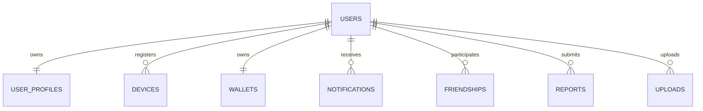

---

# Identity Relationships

```
User

↓

Profile

↓

Wallet

↓

Devices

↓

Notifications

↓

Uploads
```

---

# 2. Friend System

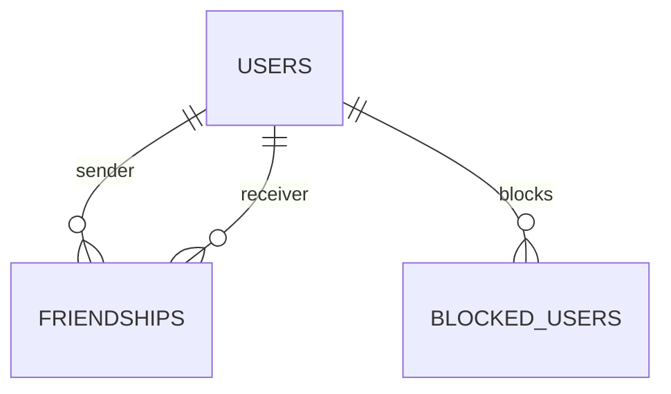

---

# 3. Party Domain

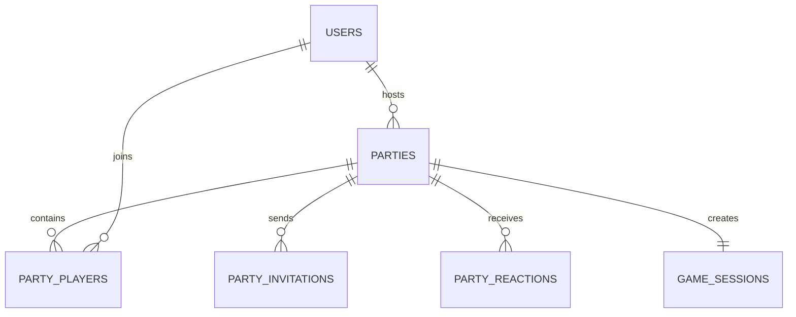

---

# Party Aggregate

```
Party

↓

Players

↓

Invitations

↓

Reactions

↓

Session

↓

Rounds

↓

Turns
```

---

# 4. Game Domain

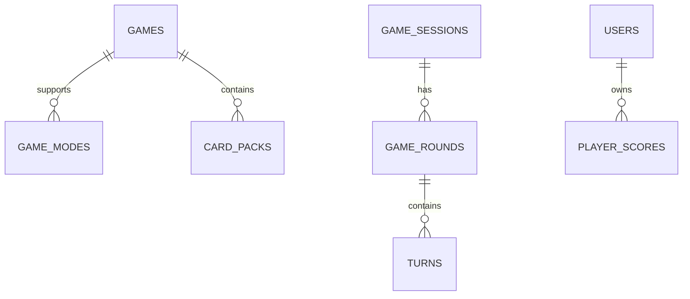

---

# Gameplay Flow

```
Game

↓

Card Pack

↓

Cards

↓

Session

↓

Round

↓

Turn

↓

Score
```

---

# 5. Card Content

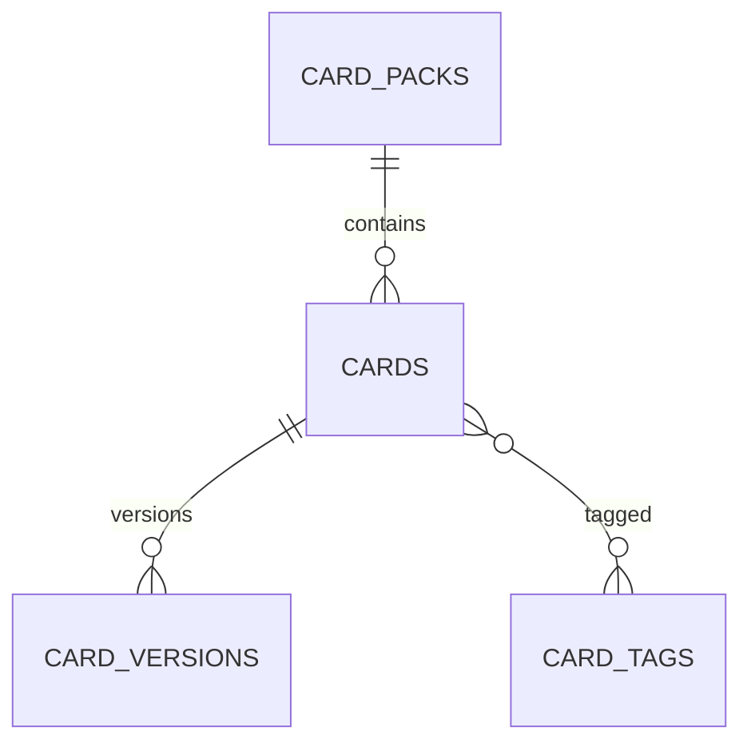

---

# Content Versioning

```
Pack

↓

Cards

↓

Versions

↓

Translations

↓

Tags
```

---

# 6. Wallet Domain

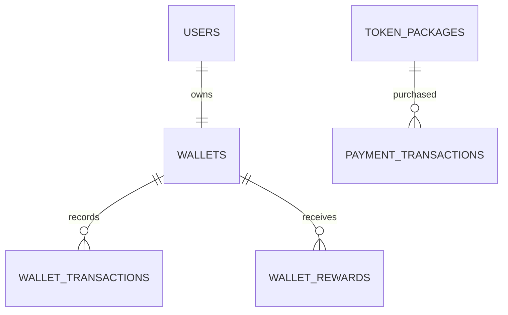

---

# Wallet Aggregate

```
Wallet

↓

Transactions

↓

Rewards

↓

Purchases
```

---

# Ledger Flow

```
Wallet

↓

Transaction

↓

Balance

↓

Analytics
```

---

# 7. Marketplace

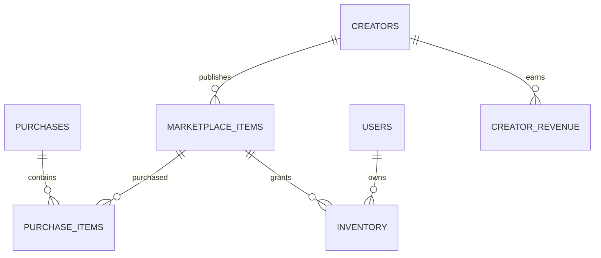

---

# Marketplace Aggregate

```
Creator

↓

Marketplace Item

↓

Purchase

↓

Inventory

↓

Revenue
```

---

# 8. Creator Domain

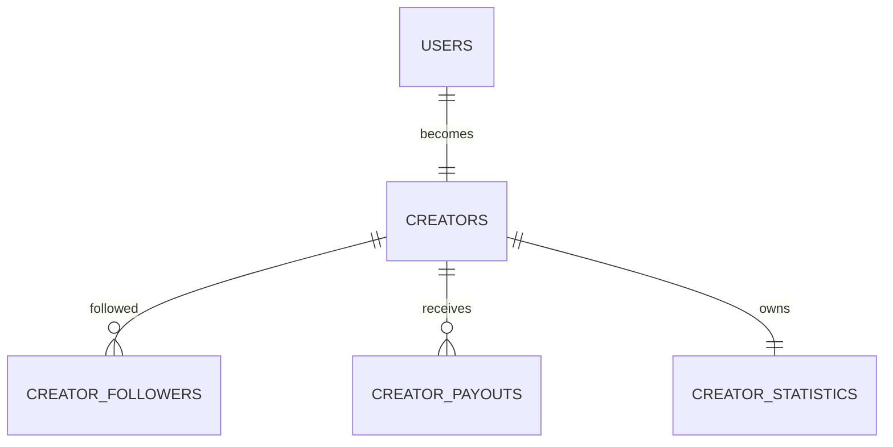

---

# Creator Relationships

```
Creator

↓

Followers

↓

Marketplace

↓

Revenue

↓

Payouts

↓

Statistics
```

---

# 9. Enterprise Domain

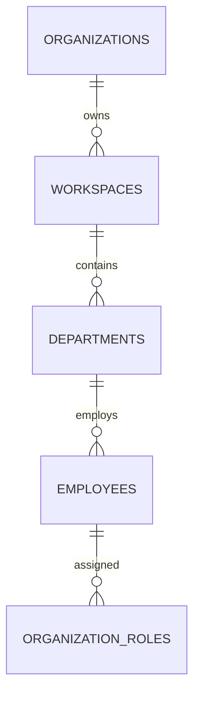

---

# Enterprise Hierarchy

```
Organization

↓

Workspace

↓

Department

↓

Employee

↓

Role
```

---

# 10. Messaging Domain

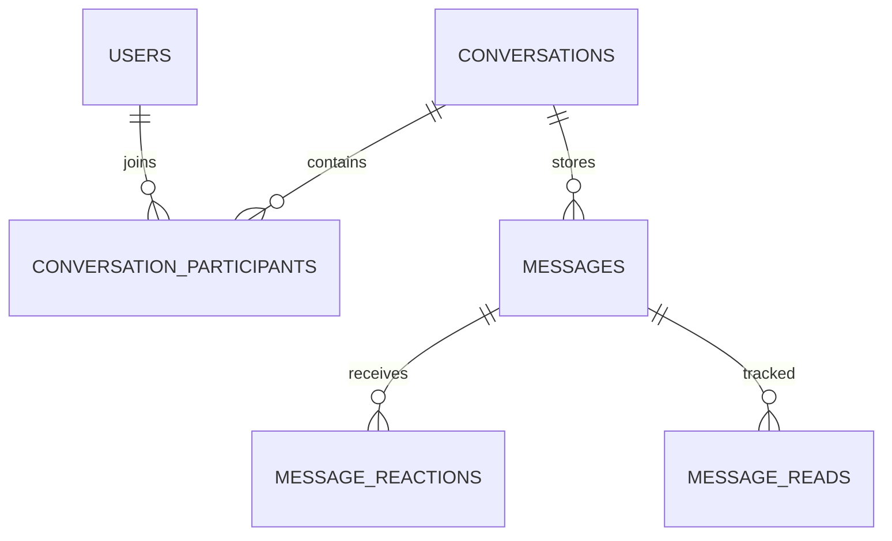

---

# Messaging Flow

```
Conversation

↓

Participants

↓

Messages

↓

Reads

↓

Reactions
```

---

# 11. Notifications

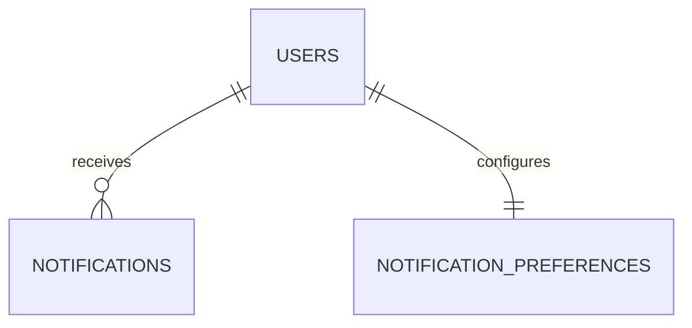

---

# 12. AI Domain

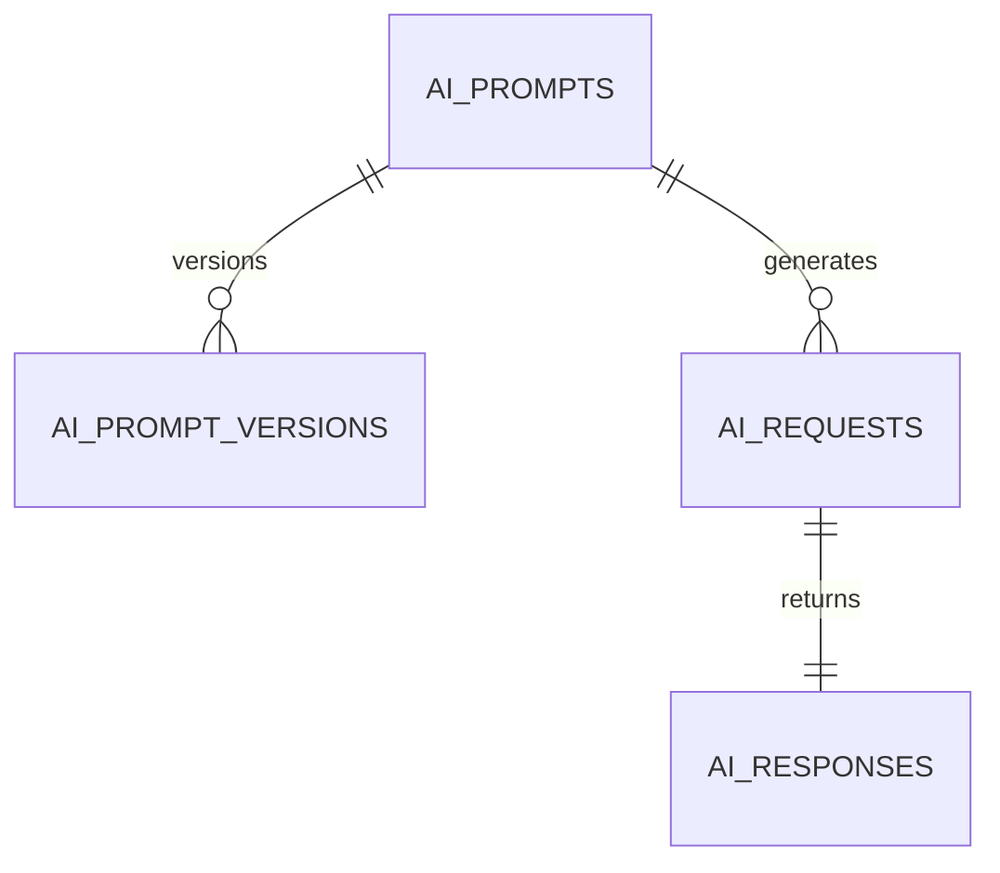

---

# AI Pipeline

```
Prompt

↓

Version

↓

Request

↓

Response
```

---

# 13. Analytics Domain

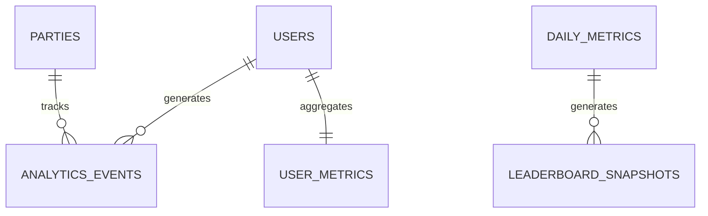

---

# Analytics Flow

```
User

↓

Events

↓

Aggregation

↓

Metrics

↓

Reports
```

---

# 14. Moderation Domain

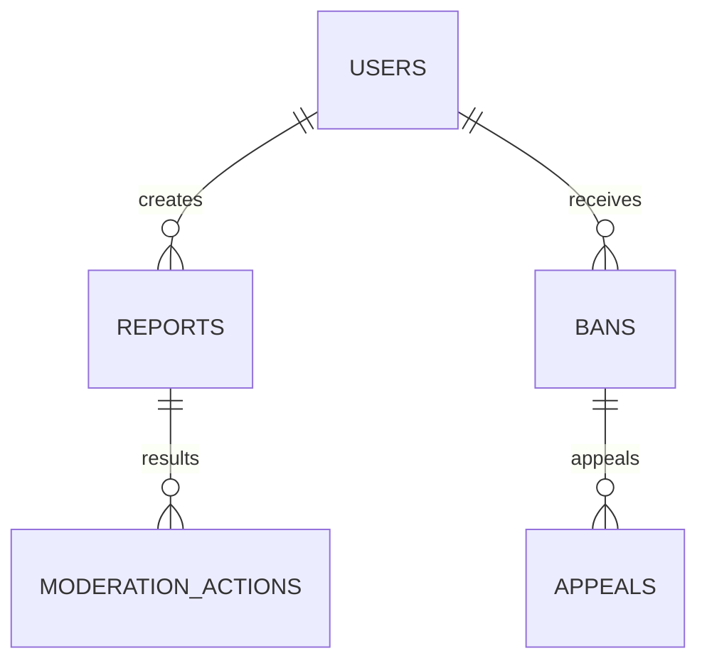

---

# Moderation Flow

```
Report

↓

Review

↓

Action

↓

Appeal
```

---

# 15. Sponsors

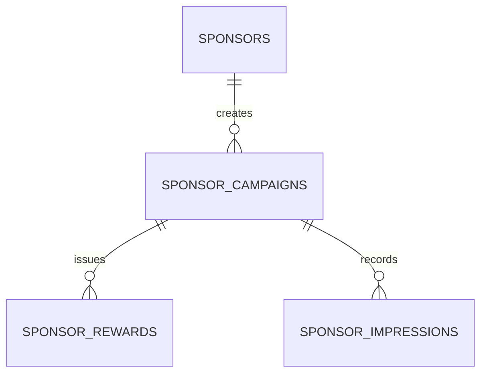

---

# Sponsor Flow

```
Sponsor

↓

Campaign

↓

Reward

↓

Claim

↓

Analytics
```

---

# 16. Payments

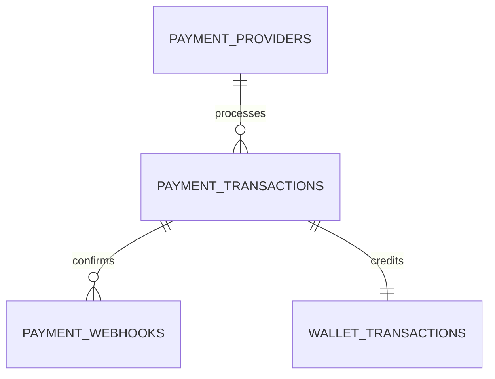

---

# Payment Flow

```
Provider

↓

Payment

↓

Webhook

↓

Wallet

↓

Ledger
```

---

# 17. Storage Domain

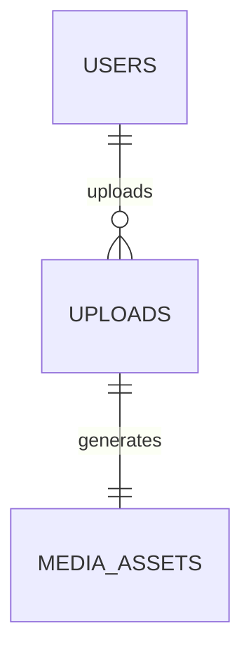

---

# 18. Audit Domain

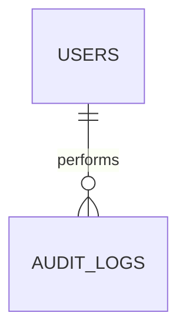

---

# Master Platform Diagram

```text
Users
 │
 ├── Profile
 ├── Wallet
 ├── Friends
 ├── Parties
 │      ├── Players
 │      ├── Rounds
 │      └── Turns
 │
 ├── Marketplace
 │      ├── Purchases
 │      ├── Inventory
 │      └── Creator Revenue
 │
 ├── Organizations
 │      ├── Workspaces
 │      ├── Departments
 │      └── Employees
 │
 ├── AI
 ├── Notifications
 ├── Analytics
 ├── Moderation
 └── Sponsors
```

---

# Aggregate Boundaries

Identity

```
User
```

Party

```
Party
```

Wallet

```
Wallet
```

Marketplace

```
Marketplace Item
```

Creator

```
Creator
```

Enterprise

```
Organization
```

---

# Cross-Domain Relationships

Examples

```
Party

↓

Wallet Reward

↓

Notification

↓

Analytics

↓

Leaderboard
```

---

# Cascade Rules

CASCADE

Party Players

Conversation Participants

Uploads

SET NULL

Analytics References

Historical Reports

RESTRICT

Wallet Transactions

Payment Transactions

Creator Payouts

Audit Logs

---

# Multi-Tenant Relationships

Every tenant-owned table includes

```
tenant_id
```

Cross-tenant relationships are forbidden.

---

# Diagram Maintenance Rules

Every new table

Must update

ER Diagram

Schema Reference

Migration Documentation

---

# Future Domains

Reserved

```
Guilds

Achievements

Badges

Quests

Season Pass

Tournaments

Developer Apps

Plugins

API Keys

Subscriptions

Digital Collectibles

AR Sessions

VR Rooms
```

---

# Claude Code Instructions

When introducing database changes:

1. Update the ER diagrams before merging.
2. Keep aggregates cohesive.
3. Avoid circular dependencies.
4. Respect aggregate boundaries.
5. Preserve referential integrity.
6. Document every new relationship.
7. Keep Mermaid diagrams synchronized with migrations.
8. Update this document whenever tables or relationships change.

---

# Acceptance Criteria

The ER Diagram Reference is complete when:

- Every domain has a visual diagram.
- Every relationship is documented.
- Aggregate boundaries are defined.
- Cross-domain interactions are clear.
- Cascade behaviors are documented.
- Developers can understand the data model without reading migrations.

---
