# Yowimo Sequence Diagrams

**Version:** 1.0.0

**Status:** System Interaction Specification

**Priority:** CRITICAL

**Owner:** Platform Engineering

**Architecture**

Laravel

React Native

Reverb

LiveKit

Redis

PostgreSQL

**Depends On**

- 22_BACKEND_SERVICE_CATALOG.md
- 39_REST_API_REFERENCE.md
- 40_WEBSOCKET_EVENT_CATALOG.md
- 41_DOMAIN_EVENT_CATALOG.md
- 42_QUEUE_JOB_REFERENCE.md

---

# Purpose

This document illustrates how different components interact over time.

Sequence diagrams explain

- API flow
- Service interaction
- Database operations
- Queue dispatching
- Realtime broadcasting
- AI orchestration
- Wallet transactions
- Marketplace purchases

These diagrams serve as the implementation blueprint for developers.

---

# Diagram Legend

```
User

React Native

API

Controller

Service

Repository

Database

Queue

Reverb

LiveKit

AI

Notification

Analytics
```

---

# 1. User Registration

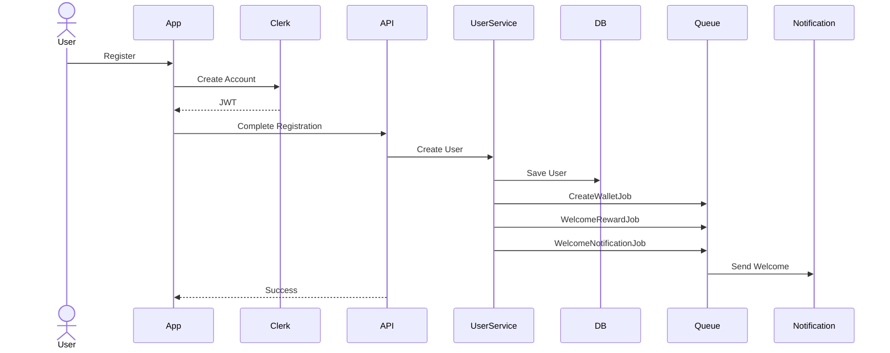

---

# 2. User Login

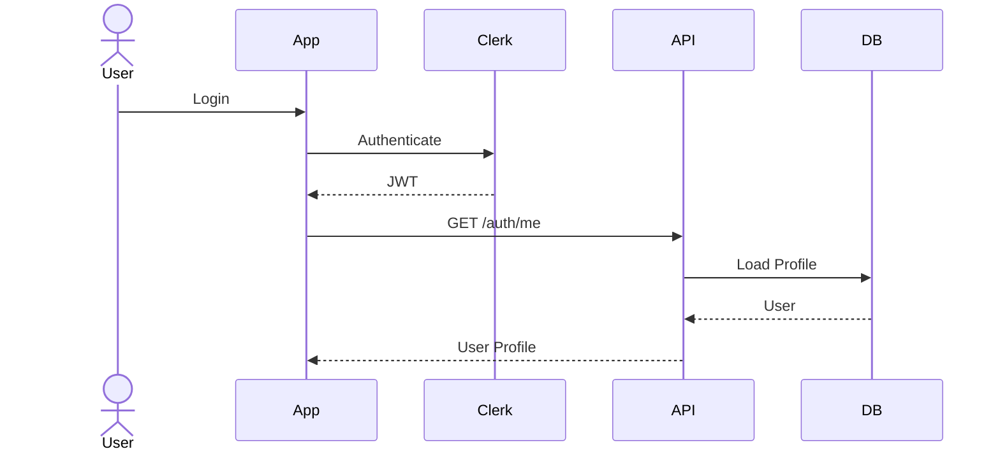

---

# 3. Create Party

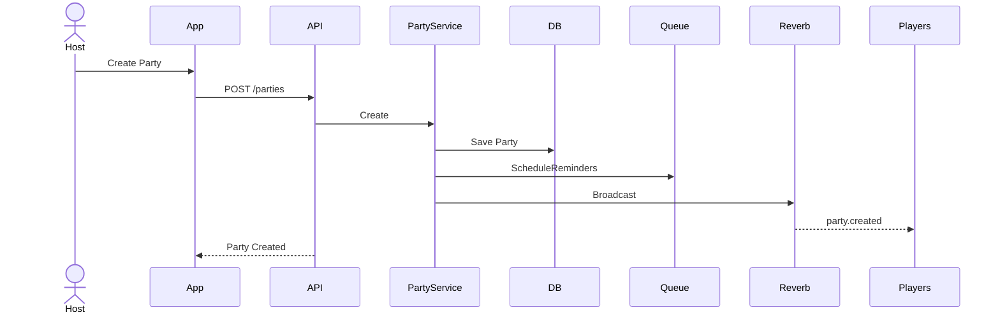

---

# 4. Join Party

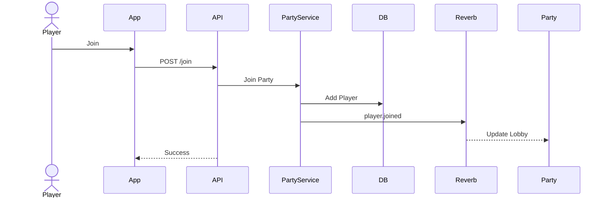

---

# 5. Start Game

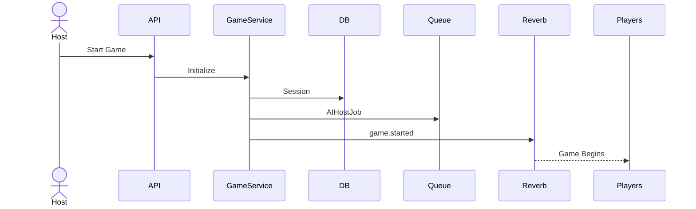

---

# 6. Complete Challenge

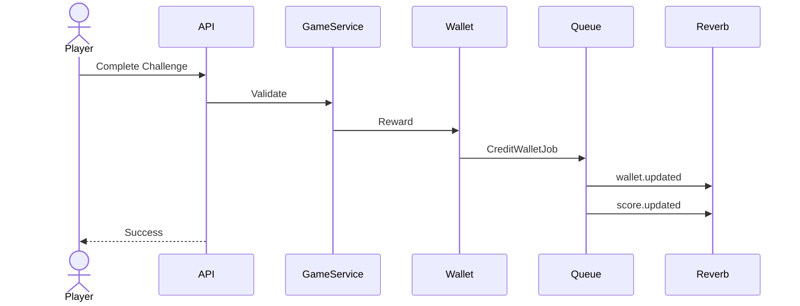

---

# 7. Wallet Purchase

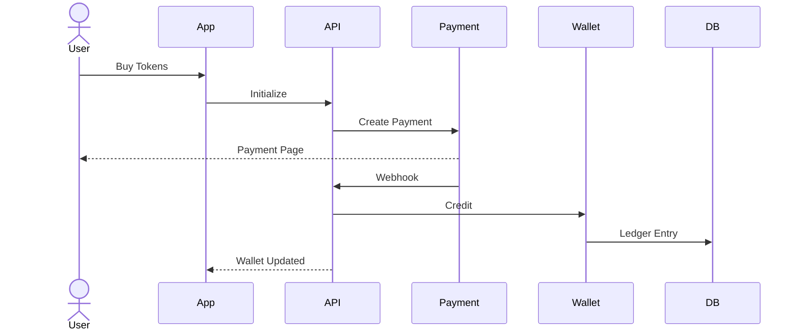

---

# 8. Marketplace Purchase

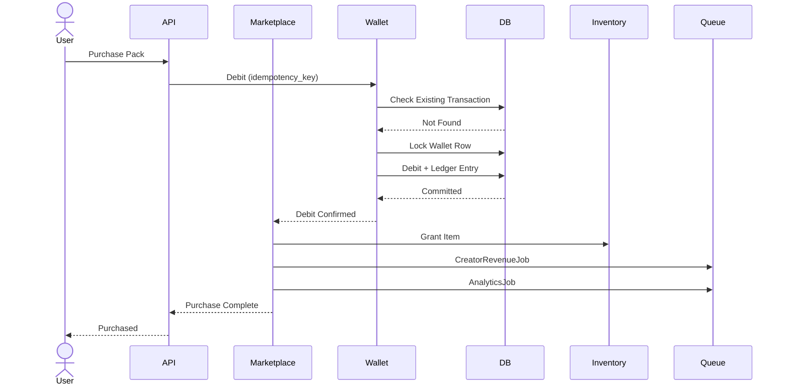

---

# 9. Creator Payout

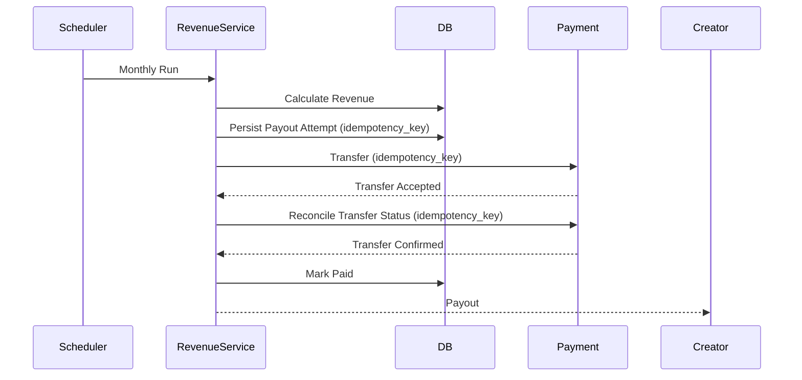

---

# 10. Send Chat Message

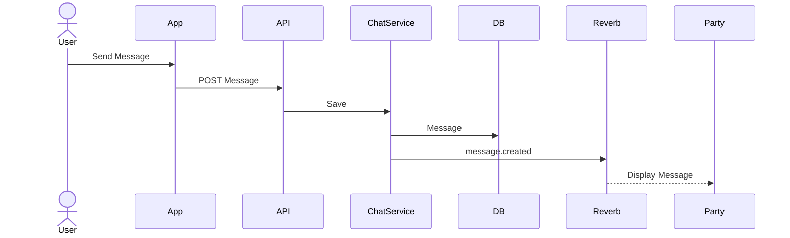

---

# 11. AI Party Host

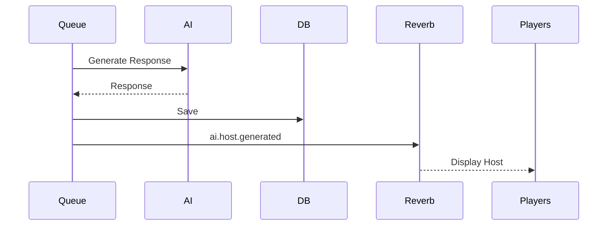

---

# 12. Push Notification

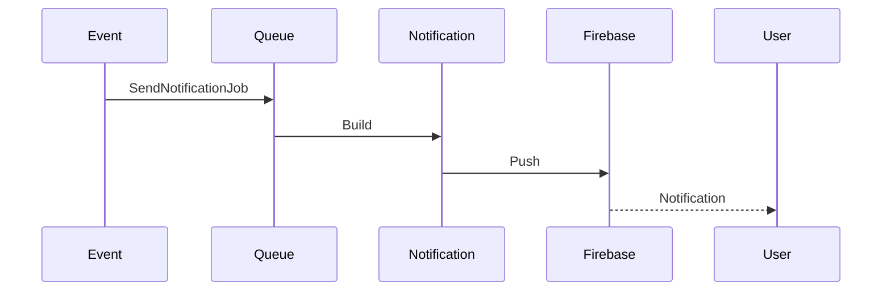

---

# 13. Friend Request

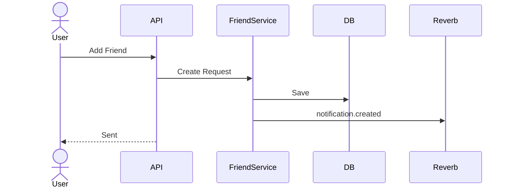

---

# 14. Organization Invitation

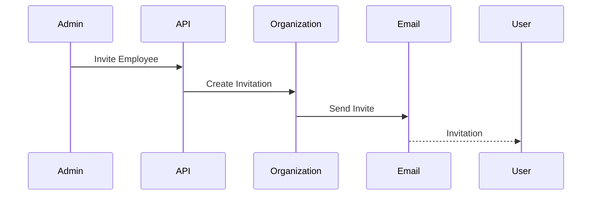

---

# 15. Report Content

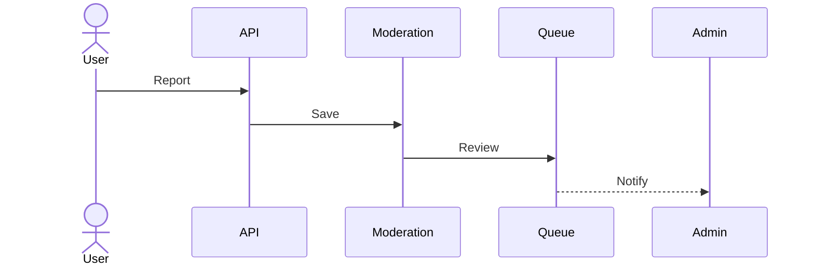

---

# 16. File Upload

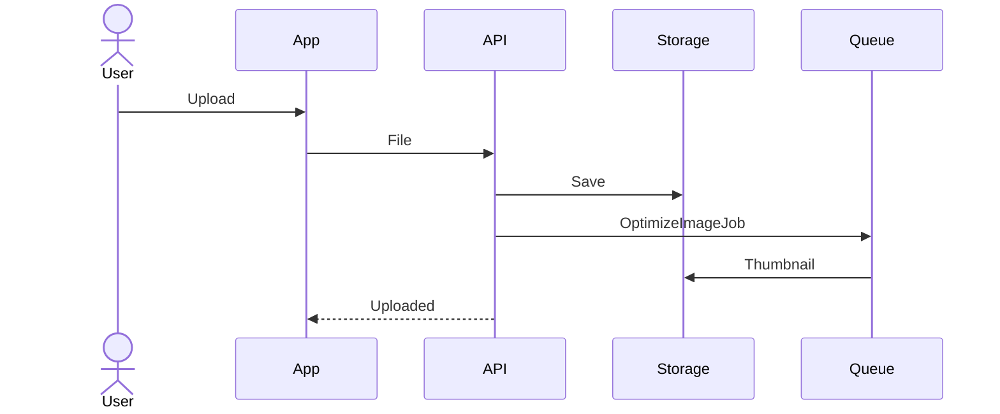

---

# 17. Referral Reward

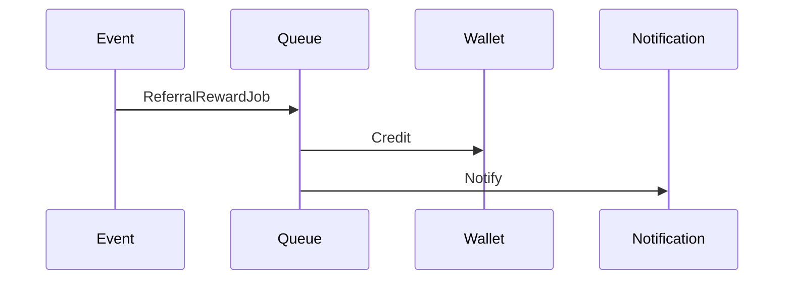

---

# 18. Leaderboard Update

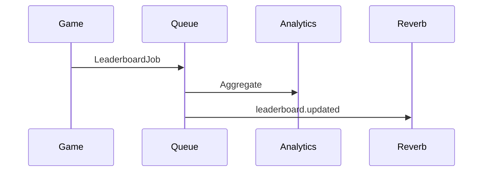

---

# 19. Live Voice Room

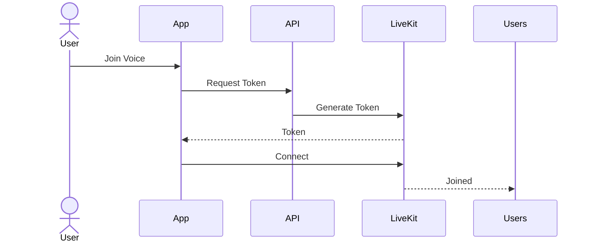

---

# 20. Emergency Rollback

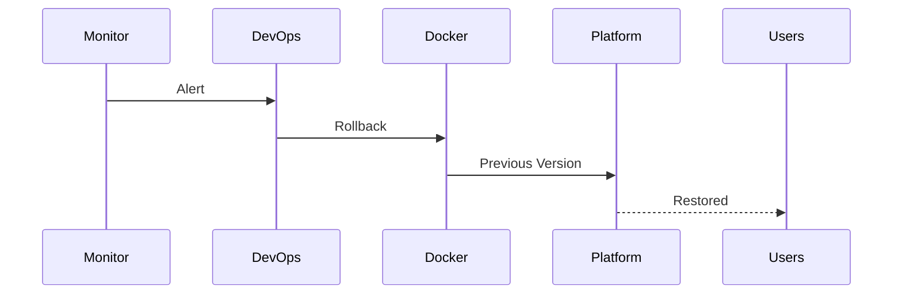

---

# Cross-Service Interaction Rules

Controllers communicate with

Services

Services communicate with

Repositories

Repositories communicate with

Database

Queues communicate with

Workers

Workers communicate with

External Services

Realtime broadcasts originate

After successful persistence.

---

# Design Rules

✓ Controllers never communicate directly with the database.

✓ Services own business logic.

✓ Queues execute heavy operations.

✓ Events coordinate independent services.

✓ Reverb broadcasts only persisted state.

✓ LiveKit manages media only.

---

# Future Sequence Diagrams

```
Tournament Flow

Achievement Unlock

Guild Creation

Plugin Installation

Developer OAuth

AR Session

VR Party

AI Storytelling

Subscription Renewal

Corporate Training Session

Season Pass Progression
```

---

# Claude Code Instructions

When implementing workflows:

1. Follow these interaction sequences.
2. Never bypass the service layer.
3. Persist data before broadcasting.
4. Queue long-running operations.
5. Keep services loosely coupled through events.
6. Maintain transaction boundaries.
7. Update sequence diagrams whenever workflows change.
8. Keep Mermaid diagrams synchronized with implementation.

---

# Acceptance Criteria

The Sequence Diagram Reference is complete when:

- Every critical workflow is documented.
- Service interactions are standardized.
- Queue boundaries are defined.
- External integrations are visualized.
- Developers can implement features directly from these diagrams.
- Documentation remains synchronized with production behavior.

---
